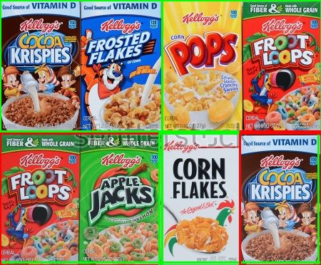

# allercery
HackPrinceton Fall 2017: Grocery Aisle Allergen partitioning app

No longer will anyone have to worry about allergic reactions because they're too lazy to read through the ingredients for each and every food item they would like to buy. Introducing Allercery, the app that tells you what foods you can and cannot eat based on nothing more than a picture and your allergies. Using optical character recognition and image classification, Allercery can deduce the foods that are safe for you from a single picture. Now being deathly allergic and lazy can go hand in hand for everyone.

Disclaimer: we are not responsible for any death or serious injuries from misusing Allercery with little to no thought.